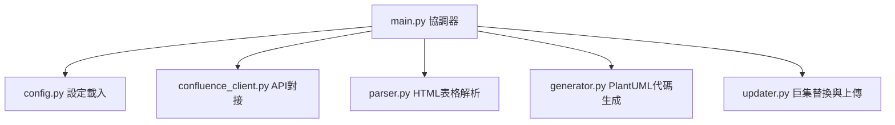

# Confluence 跨專案 Gantt Roadmap 自動化整合工具 (PlantUML 專業版)

此工具專為專案經理（PM）與軟體專案經理（SWPM）設計，能自動從 Confluence 專案網頁中，抓取所有專案開發里程碑（C0-C5 或 P0-P5）資料表格，透過 **PlantUML** 繪圖引擎，在網頁最上方動態生成並更新一幅專業、高對比、且支援季度/月份切換的跨專案 Roadmap 甘特圖。

---

## 🎯 專案目的與核心價值
* **例外管理 (Management by Exception)**：整合 Confluence 原生的 `Handy Status` 狀態巨集，使延遲專案標為深紅、追趕中標為黃色、正常標為深綠，主管一眼即可鎖定異常專案。
* **高階時程整合**：將跨年度（例如 2026 ~ 2027 年）的 30+ 個專案排程扁平化，於同一水平列以彩色區間連續柱狀呈現，減少視覺雜訊。
* **低維護成本 (Zero Maintenance)**：資料源與產出圖表共存於同一個 Confluence 頁面。PM 僅需正常更新資料表格，系統執行後甘特圖即可自動同步，不需手動繪圖。

---

## 🛠️ 核心功能與視覺設計
### 1. 🌈 專業莫蘭迪配色系統 (非黑高對比)
* **專案時程區間**：各階段 (P0-P5 / C0-C5) 採用高辨識度莫蘭迪色系連續拼接，C5/P5 結尾採綠色代表 GA 出貨。
* **年度背景色塊**：自動辨識時間軸跨越的年度，2026 年渲染為極淡粉橘 (`#FDF2E9`)，2027 年渲染為極淡薄荷綠 (`#E8F8F5`)，年度分界極其清晰。
* **專案名稱狀態著色**：
  * `🟢 On Track` ➔ 專案名稱顯示為 **森林深綠 (`#1E8449`)**
  * `🟡 CATCHING UP` ➔ 專案名稱顯示為 **深黃銅色 (`#B9770E`)**
  * `🔴 NEED SUPPORT` ➔ 專案名稱顯示為 **深寶石紅 (`#922B21`)**
  * 無狀態/預設 ➔ 專案名稱顯示為 **深海軍藍 (`#1F4E79`)**

### 2. 🧭 智慧時間軸定位與輔助線
* **動態 NOW 指標**：自動在今天日期的網格上方繪製一個紅色的 `[NOW]` 里程碑菱形，並直直垂下一條紅色時間輔助線。
* **年度垂直線**：自動在每年 1 月 1 日（如 `2027-01-01`）繪製亮灰色年度分界輔助線。
* **右側鏡像專案標記**：在時程橫條最右端（P5 尾端）自動附加 `P5 (專案名稱)`，讓使用者向右捲動檢視時，不需回頭對照左側名稱。

### 3. 🧠 健壯的 HTML 解析器 (Robust Table Parser)
* **標頭驅動定位 (Header-driven offset)**：自動偵測 `Status`、`Project`、`Milestone` 欄位在表格中的位置，即使未來調整表格欄位順序或新增欄位，解析器亦不會出錯。
* **多元格式支援**：支援 `C0-C5`、`P0-P5`，並可抓取頁面上多個獨立表格進行跨表資料合併。
* **容錯日期正規化**：支援各種手輸入日期格式（如 `2026/08/30`、`@2026.08.30`），自動清洗並統一輸出為 `YYYY-MM-DD`。

---

## 📂 程式架構與模組分工



* **[config.py](file:///c:/Users/jonathancc_kao/Vibe_Coding/RoadmapCollection/config.py)**: 管理設定值，支援從 `.env` 與 `DC_Key.env.txt` 讀取 Token 等敏感情資。
* **[confluence_client.py](file:///c:/Users/jonathancc_kao/Vibe_Coding/RoadmapCollection/confluence_client.py)**: 封裝 Confluence API，提供 Basic 與 Bearer Auth (PAT) 認證。
* **[parser.py](file:///c:/Users/jonathancc_kao/Vibe_Coding/RoadmapCollection/parser.py)**: 利用 BeautifulSoup 解析表格，包含專案名稱提取、Handy Status 巨集字串對齊、以及列合併 `rowspan` 解析。
* **[generator.py](file:///c:/Users/jonathancc_kao/Vibe_Coding/RoadmapCollection/generator.py)**: 負責將解析好的專案列表轉化為符合 PlantUML 甘特圖語法的字串。
* **[updater.py](file:///c:/Users/jonathancc_kao/Vibe_Coding/RoadmapCollection/updater.py)**: 定位並替換網頁 HTML 中的 `<ac:structured-macro ac:name="plantuml">` 區塊，支援全新插入與就地覆寫。
* **[main.py](file:///c:/Users/jonathancc_kao/Vibe_Coding/RoadmapCollection/main.py)**: 專案進入點。

---

## ⚙️ 環境變數設定

您可以直接在 `DC_Key.env.txt` 中配置以下設定來調整圖表外觀：

| 環境變數 | 說明 | 預設值 | 建議設定值 |
|---|---|---|---|
| `CONFLUENCE_URL` | Confluence 伺服器網址。 | `https://wiki.moxa.com` | `https://wiki.moxa.com` |
| `CONFLUENCE_TOKEN` | 個人存取權杖 (PAT) 或 API Token。 | *必填* | |
| `SOURCE_PAGE_ID` | 資料來源網頁 Page ID。 | `627857514` | |
| `ZOOM_FACTOR` | 圖表橫向拉展的縮放倍率。專案多、時間跨度長時建議設大。 | `5` | `3` ~ `7` |
| `TIMELINE_SCALE` | 時間軸最小顯示刻度：`quarterly` (季度) 或 `monthly` (月份)。 | `quarterly` | `quarterly` |
| `RENDER_MODE` | 繪圖渲染引擎：`plantuml` 或 `mermaid`。 | `plantuml` | `plantuml` |

---

## 🏃 常用指令

### 1. 安全測試模式 (不寫回網頁，僅印出 PlantUML 代碼)
```bash
python main.py --dry-run
```

### 2. 正式更新 Confluence 網頁
```bash
python main.py
```

### 3. 執行離線自動化單元測試 (共 11 個測試案例)
```bash
python -m unittest test_parser.py
```

---

## 💡 後續維護與功能擴充指南

### Q1: 如何增減 Milestone 階段（例如新增 P6）？
1. 在 **[generator.py](file:///c:/Users/jonathancc_kao/Vibe_Coding/RoadmapCollection/generator.py)** 的 `MILESTONE_LABELS` 與 `MILESTONE_COLORS` 字典中，新增對應標籤與色碼：
   ```python
   "p6": "P6",
   "p6": "#9B59B6" # 填入喜愛的 HEX 顏色
   ```
2. 在 `generate_plantuml_gantt` 函式的 `milestone_keys` 陣列尾端加入 `"p6"` 即可：
   ```python
   milestone_keys = ["c0", "c1", "c2", "c3", "c4", "c5", "p0", "p1", "p2", "p3", "p4", "p5", "p6"]
   ```

### Q2: 如何調整年度背景的顏色？
在 **[generator.py](file:///c:/Users/jonathancc_kao/Vibe_Coding/RoadmapCollection/generator.py)** 的 `year_backgrounds` 列表中修改對應的 HEX 色碼：
```python
year_backgrounds = [
    "#FDF2E9",  # 第一年背景 (預設淡橘色)
    "#E8F8F5",  # 第二年背景 (預設淡薄荷綠)
    # ... 您可以自由替換或新增更多年份的循環顏色
]
```
